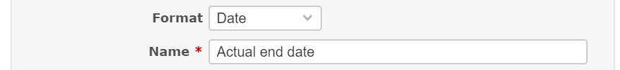

# Redmine Actual Date Plugin

## Description
This is the plugin for [Redmine](http://www.redmine.org/).
This plugin displays the actual dates bar on the Gantt chart.
The actual start/end date is custom field value.

## Installation
1. Install the plugin
    - A. Without Git
        1. Download the [Zip file](https://github.com/sk-ys/redmine_actual_date/archive/master.zip) and extract files into your Redmine plugin directory.
        2. Rename the directory name to `redmine_actual_date`.
    - B. With Git
        1. Set the current directory to the Redmine plugin directory.
        2. Use this command. `git clone https://github.com/sk-ys/redmine_actual_date redmine_actual_date`.
2. Restart Redmine (Migration is no needed.)

## Plugin Setup
### 1. Create the actual start/end date fields as Issues custom field
#### Example of creating the actual start date custom field.

#### Set the actual end date as well.

#### Result.

### 2. Set the id of each custom field to this plugin
#### Open the configure page from plugin list page.

#### Enter the id of each custom field and apply.

## How to use
### 1. Set the actual start/end date on the issue page

### 2. Check the gantt page (result)
The actual dates yellow bar will be added.

## Notice
- Actual dates bar is drawn in JavaScript.
- PNG and PDF export is not supported.

## Change Logs
- v0.0.2:
    - Feature
        - Add permission: `view actual dates bar`
        - Bar is now customizable in the plugin's configuration page
        - Rearrange issue page
- v0.0.1: first development version
